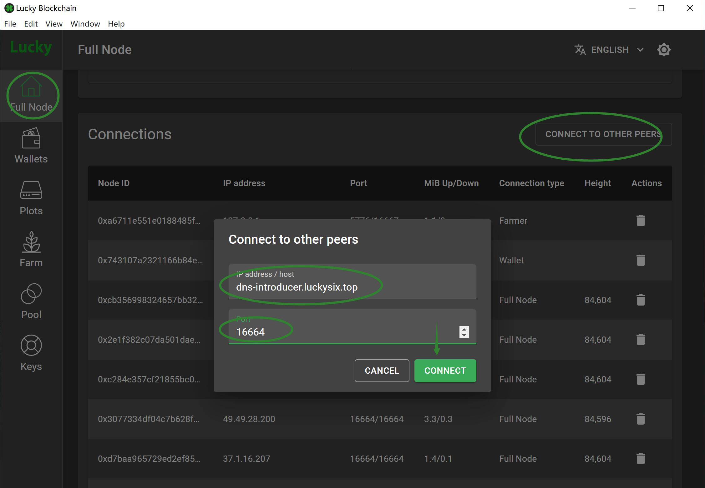
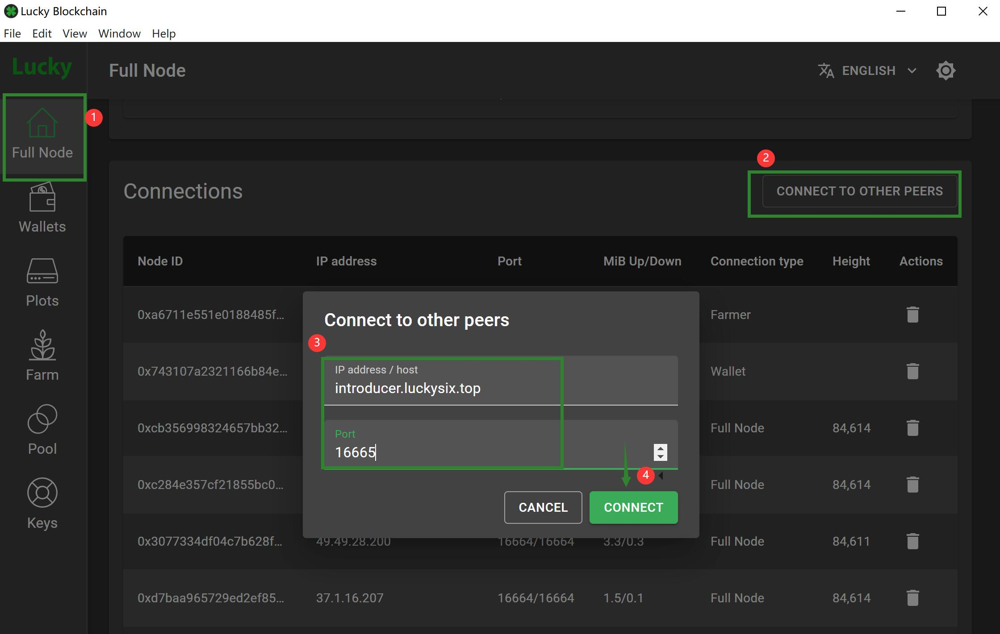
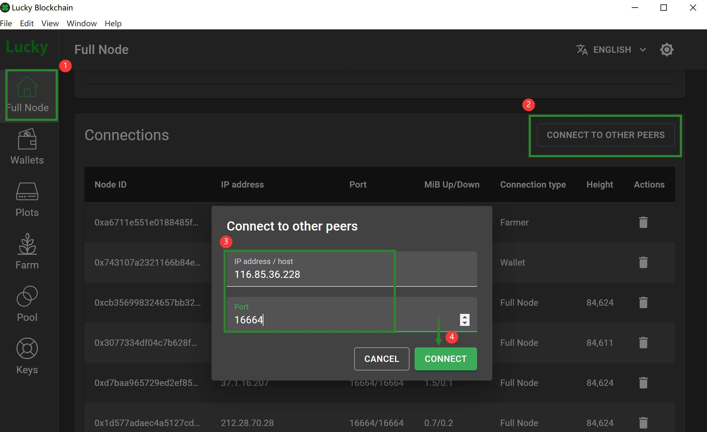

## Everyone, Good Luck!  

  
  
# What is Lucky

There is no doubt that this is a FORK of chia, but we use it to express different meanings

Hi Lucky man , Good Luck !  

LuckyChain  means to deliver  blessing and praise   

Lucky HODLer are all Lucky Dog....e  

If you like her, give her lucky  

If you think he's great, give him lukcy  

If you worship him, give him lucky  

6 Lucky coin, Good!   
66 Lucky coin, Great!!  
666 Lucky coin, Excellent!!  

[What does 666 mean?] (https://baike.baidu.com/item/666/17192634)

# How to use lucky

Lucky can be used as a blockchain gift coin
We hope that lucky will be used to like(点赞), reward（打赏）, donate（捐赠）, and pay for knowledge（知识付费）.  
If you like a person,  
like his creation,   
like his contribution,   
give him some LUCKY,   

hope he can have better luck and create better things  

Everyone is the node and center of this world, if they do great things, they deserve to be encouraged  

Price is not equal to value, but value needs to be reflected by price. If possible, we will also seek listing. 

# Change

Block Reward :  
total :18six, farmer:12,pool:6 (first month)  
total :6six,  farmer:4, pool:2 (first three year)  
total :3six,  farmer:2, pool:1 (second three years)  
....three year ,half reward...  
After 12 years, it will remain unchanged  

Special Reward(Benefit the latecomers):  

Find the height of the block with the end of 6, and there is a special reward  
Special reward will not be halved, it will remain the same  

ends with 6 , reward 6  
ends with 66 , reward 66  
ends with 666 , reward 666  
ends with 6666 , reward 666  

666 is the biggest reward  

support Old Plot (chia 1.1.17-) and New NFT Plot (chia 1.2.0+)  

PreFarm: 666,666six  

# DownLoad 

Installation package  

[Windows](https://github.com/dream80/lucky-blockchain/releases/download/v1.2.10.10/LuckySetup-1.2.10.10.exe)
[Ubuntu20.04](hhttps://github.com/dream80/lucky-blockchain/releases/download/v1.2.10.11/lucky-1.2.10.11_amd64.deb)  

MacOS Coming soon  

Latest DB file  
[MEGA](https://mega.nz/folder/nT5FUa7I#aY_FbOMtRz6b4dWkKFib3g)  
[GoogleDrive](https://drive.google.com/drive/folders/1SD5fq_h8-Gel0bKIjtsJOcTDKfj99FCC?usp=sharing)  
[BaiduPan](https://pan.baidu.com/s/1I2xBHdXE1jJJGvgXNOz47A)(code:kk7w)  

# Group  

Join the group, you can get lucky coins for free , We plan to send some lucky coins to group members every week  

[Discord](https://discord.gg/pgdj4snppb)  
[QQ](https://jq.qq.com/?_wv=1027&k=RJp9meKz)  

# Website
Official website  
[www.luckysix.top](https://www.luckysix.top/)  
[Twitter](https://twitter.com/LuckySixChain)  
  

Others  
[Blockexplorer](https://alltheblocks.net/lucky)  
[xchfokrs](https://xchforks.com/lucky/)  
[chiaforkscalculator](https://chiaforkscalculator.com/lucky)  
[forksgreen](https://www.forks.green)    
[chianow](https://chianow.net)   

# FullNode

node:dns-introducer.luckysix.top, Port:16664  

  

node:introducer.luckysix.top, Port:16665  

  

IP list，port:16664  
47.98.232.124  
31.206.76.246  
114.23.201.128  
162.255.13.151  
179.223.212.224  
119.204.14.65  
194.96.178.6  
89.178.1.172  
202.184.203.184  
120.245.60.77  
118.250.3.241  
176.15.219.57  
124.77.29.143  
96.3.26.205  
78.139.82.160  
117.4.243.27  
202.153.222.37  
83.99.251.138  
170.250.224.112  
212.28.70.28  
31.19.149.2  
116.85.36.228  
39.120.60.133  
122.116.254.215  
62.197.209.47  
178.254.220.4  

  

[xchforks]https://xchforks.com/lucky/  
[MoreNode]https://penny-faucets-for-chia-forks.net/peers/#Lucky-SIX  

# Some common problems

##  Why there is no reward

Why the proof was found, but the coins were not obtained？

The most likely thing is that your wallet has not been synchronized yet, and the rewards won will only be displayed if the wallet is synchronized.  

In another case, the reward address of the farm is not your current wallet address. It often appears on people with two wallets(check your another wallet)  

## How to sync quickly?

The sync is too slow and the coins are token by others, what should I do? The quickest way is to directly use the synchronized DB file. The method of use is as follows:

1. Close the software after successful installation of Lucky

2. Download the DB folder

3. Replace the local DB folder

The local DB file path is generally: C:\Users\tony\\.lucky\mainnet\  **tony** is the user name of your computer

## How to get more coins?

In the case that the plots file remains unchanged, you can get a higher probability of block explosions by making yourself a shared node

There are several ways to share your own nodes:

1. Port mapping (port:16664)

2. DMZ

3. upnp
  
*If your Farmer PC have a public IP, you don’t need to do anything

## How to retrieve NFT pool rewards?

In lucky, the old plots are 100% reward, and the new plot has 2/3.   
If you want to retrieve the other 1/3, you can refer to it  
https://alltheblocks.net/nft-recovery  
https://github.com/Flora-Network/fd-cli  

## How to buy and sell?  

[forksgreen](https://www.forks.green)    
[chianow](https://chianow.net)   

step:  
1. Registration  
2. Deposit  
3. Transactions  
4. Withdraw  
  

## Any other questions?
Join [Discord](https://discord.gg/pgdj4snppb) or [QQ](https://jq.qq.com/?_wv=1027&k=RJp9meKz)  
